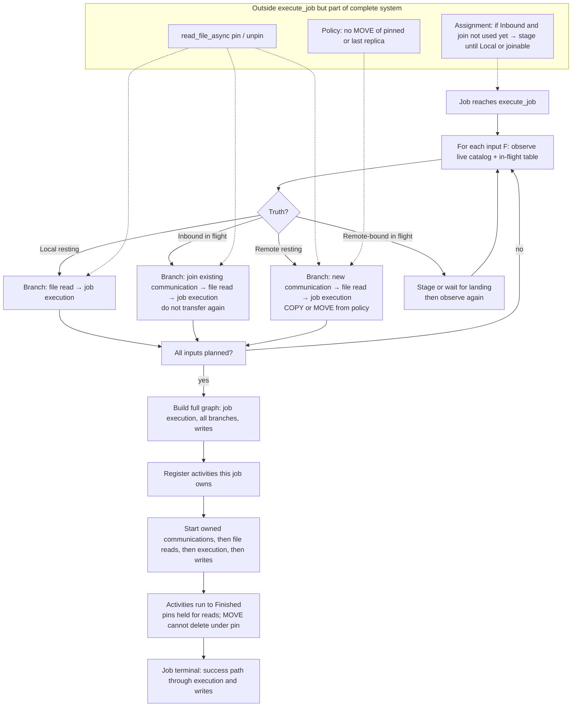

# First-principles design: complete `execute_job()` from HEAD

This document defines the high-level logic of `JOB_EXECUTOR::execute_job(Job*)` so that every data-placement scenario the simulator can create has a defined, terminating outcome. It starts from HEAD’s working activation skeleton and extends the decision surface only where HEAD is incomplete. It is not a trial plan.

---

## 1. First principles

A job finishes simulation-wise only when every activity it registered reaches a terminal state (Finished or an explicit clean failure that cancels siblings). Stuck `WAITING` activities are not a modeled grid outcome; they are an incomplete executor.

File data for one input of a job, relative to that job’s compute site, is always observable. Observation must look at both the replica catalog and every in-flight file transfer for that filename. Under the model of this simulator, a file is never “gone from the world”: every initial placement and every legal operation either leaves at least one resting replica somewhere, or leaves the bytes inside one or more successful standalone in-flight transfers that will each land at a known destination site. The close case that looks like “no replica on any site” is a MOVE of the sole resting replica (or concurrent transfers that have already taken the last resting replica out of the catalog) while those transfers are still running; the file is not absent—it is in transit.

The observable outcomes used by planning are therefore:

1. **Local resting replica** — the catalog shows the file at the job’s compute site.
2. **Inbound in-flight transfer** — no resting replica at the compute site yet, but an in-flight transfer will land the file at the compute site.
3. **Remote resting replica** — no local resting replica, no inbound landing at the compute site, and the catalog shows the file at least at one other site.
4. **Remote-bound in-flight transfer** — no resting replica anywhere yet, but one or more in-flight transfers will land the file at other site(s); wait until at least one such landing creates a resting replica, then apply the observation order again.

Those outcomes are exhaustive for legal runs under the scope in Section 3.1. COPY, MOVE, proactive background transfer, drop-in transfer, multi-job contention, and pin-protected local reads only change which outcome is observed, or which site is chosen as source under a remote outcome. They do not create a fifth outcome in which the file has neither a resting replica nor any in-flight landing.

From that follows the completeness rule for `execute_job`:

> For each input file, map its observed outcome to exactly one activity branch that both starts and finishes. Never create a second communication activity for the same file to the same destination. Never start a local file read that depends on a replica the catalog does not guarantee for the lifetime of that read. Never leave half a job registered.

HEAD already encodes the safe activation pattern for the cases it knew about: create the job execution activity, for each input create and wire activities into vectors without starting them, create write activities, register everything into the pending set, then start communication activities, then file reads, then execution, then writes. The edit is not to invent a new activation machine. The edit is to make the per-file branch selection cover every outcome in Section 3, using live catalog and in-flight state, while preserving that activation machine.

Pins, MOVE skip, and assignment staging are not optional decorations. They are the invariants that keep the four truths stable between “observe” and “Read runs.” Without them, **Local** can become false under an already-started Read, which is how “Started FileRead never Finished” appears even when activation order looks correct.

---

## 2. What HEAD already gets right (keep)

HEAD `execute_job` structure (conceptual):

```text
create Exec
for each input:
  ask policy for (source, mode)
  if source != site: create Comm, create Read, wire Comm → Read → Exec
  else:              create Read, wire Read → Exec
for each output: create Write, wire Exec → Write
register all into pending_activities
start all Comms, then all Reads, then Exec, then all Writes
```

Keep these properties without negotiation:

- One Exec per job; all input Reads are predecessors of Exec; Writes are successors of Exec.
- Build and wire first; register second; start third. No `start()` inside the per-file loop.
- Transfer path is always Comm then Read, never Read before Comm.
- Policy may choose source and COPY versus MOVE; the executor does not invent placement policy.

HEAD’s incompleteness is only that it assumes: if policy names a remote source, calling `transfer()` is always legal; if policy names the local site, the replica will still be there when the Read runs; and “already in progress” is an exception rather than a first-class truth (**Inbound**).

---

## 3. Scenario universe

### 3.1 Definitions used in this section

**Scope of this universe (assumed for completeness).** All transfers succeed; transfer failure is not modeled. Every transfer is a single standalone hop from one source site to one destination site; multi-hop paths are not modeled. There is no standalone deletion operation in the system. The only way a resting replica leaves a site is as part of MOVE semantics when a MOVE transfer runs. Concurrent in-flight transfers of the same file to **different** destinations are allowed (for example two COPYs from one source to two sites at once). Concurrent duplicate delivery of the same file to the **same** destination is not allowed.

**Replica catalog.** The simulator’s record of which sites currently hold a resting copy of a named file. A resting copy is on disk at a site and is not inside an unfinished transfer.

**In-flight transfer.** A communication activity that is already started (or owned and about to deliver) for a named file from one source site to one destination site. Until it finishes, the bytes for that delivery are in transit to that destination. For MOVE, the source resting replica is removed when MOVE semantics say so; the destination resting replica appears when that transfer completes. During a MOVE of the only resting replica, the catalog may show the file at no site while that in-flight transfer still names the destination where the file will land. Other concurrent in-flight transfers of the same file may exist only toward other destinations.

**Job compute site.** The site where the job will run its execution activity and where input file reads must eventually run.

**Local.** Relative to one job and one input file: a resting replica exists at that job’s compute site.

**Inbound.** Relative to one job and one input file: no resting replica at the compute site, but an in-flight transfer has that compute site as its destination for that file. By route exclusivity there is at most one such inbound transfer.

**Remote resting.** Relative to one job and one input file: no local resting replica and no inbound transfer to the compute site, but the catalog shows at least one resting replica at another site. Other in-flight transfers of the same file toward unrelated destinations may exist at the same time; they do not change this classification.

**Remote-bound in flight.** Relative to one job and one input file: the catalog shows no resting replica at any site, but one or more in-flight transfers will land the file at destinations other than the job’s compute site. Typical causes: sole-replica MOVE in transit, or the last resting replica already committed into transit while copies toward other sites are still running. This is not “file deleted from the universe.”

**Observation order (mandatory).** For each input file of a job, decide in this order:

1. If the catalog shows a resting replica at the job’s compute site → treat as local.
2. Else if an in-flight transfer for this file has the job’s compute site as destination → treat as inbound.
3. Else if the catalog shows a resting replica at any other site → treat as remote resting (policy may choose which source and whether the new transfer is COPY or MOVE). Concurrent in-flight transfers to other destinations may be ignored for this decision except that the new transfer must not duplicate an existing delivery to the compute site.
4. Else if one or more in-flight transfers for this file have other sites as destinations → treat as remote-bound in flight: do not invent a source; wait until at least one of those transfers lands and creates a resting replica (assignment staging, or join one chosen remote-bound transfer only as a wait barrier), then apply the same observation order again. If several remote-bound transfers exist, any successful landing that restores a resting replica is enough to leave this case; afterward step 3 (remote resting) or step 1/2 (if somehow local/inbound) applies as usual.
5. There is no legal fifth step in which neither catalog nor in-flight table can account for the file. Initial conditions always place every input file somewhere. Legal operations never destroy the last account of a file: they only COPY or MOVE it, and every MOVE of a last resting replica leaves an in-flight transfer until its destination resting replica exists.

**Pin.** A reference count on a resting replica while a file read that uses it is outstanding. MOVE must not take away a pinned resting replica. This keeps “local” true from plan time until the file read finishes. (There is no separate delete operation to refuse.)

**Route exclusivity.** Exclusivity is per (file, destination): at most one in-flight transfer may deliver a given file to a given destination at a time. A second caller that wants the same destination must join that transfer or wait in staging. The same file may have several in-flight transfers at once if and only if their destinations differ.

**Assignment staging.** A holding area before the job is sent to the host message queue and before `execute_job` runs. The scheduler puts a job into staging when that job is not yet allowed to build its input/output graph—typically because a needed file already has an inbound transfer to the compute site and starting another would collide, or because the only accounts of the file are remote-bound in-flight transfers and there is not yet a resting replica to read or copy from. Staging is not a fourth kind of file-read branch inside `execute_job`. It only delays when `execute_job` is called. When a blocking transfer finishes and a resting replica exists where the job needs it (or join becomes available), the job leaves staging, is dispatched to the compute host, and only then enters `execute_job`.

### 3.2 Scenario table

| Scenario name | Precise situation | What observation must conclude | Required executor behavior |
|---------------|-------------------|--------------------------------|----------------------------|
| Local resting replica already present | Before or during job dispatch, the file already has a resting replica at the job’s compute site (staged earlier, written earlier, or landed from a previous transfer). | Local | Create a file read at the compute site, wire it as a predecessor of the job execution activity. Do not start a communication activity for this file. |
| Remote resting replica, route free toward compute site, COPY | The compute site has no resting replica and no inbound transfer. At least one other site has a resting replica. No in-flight transfer already delivers this file to the compute site (transfers of this file toward other destinations may already be running). Policy selects a remote source and COPY. | Remote resting | Create a new standalone communication activity from the chosen source to the compute site (COPY), then a file read, wire communication → file read → job execution. This job owns starting that communication activity. |
| Remote resting replica, route free toward compute site, MOVE | Same catalog and in-flight situation as the previous row, but policy selects MOVE. | Remote resting | Same wiring as COPY, but the communication activity uses MOVE semantics (source resting replica removed according to MOVE rules when appropriate; destination resting replica appears on completion). Still only one communication activity to the compute site; other destinations may have their own concurrent in-flight transfers. |
| Concurrent in-flight transfers of the same file to different destinations | Policy or jobs have started more than one standalone transfer of the same file, each with a distinct destination (for example COPY to site A and COPY to site B at once). For a job whose compute site is one of those destinations, only the transfer aimed at that compute site matters for inbound. For a job whose compute site is none of them, those transfers are background toward other sites. | Inbound if one destination is this compute site; otherwise remote resting if any resting replica remains; otherwise remote-bound in flight if the catalog is empty | Apply the observation order unchanged. Do not merge transfers. Do not start a second transfer to a destination that already has one. Transfers to other destinations are left alone. |
| Inbound transfer owned by another job | Another job already started a communication activity that will land this file at this job’s compute site. The catalog may still show no local resting replica. Other transfers of the same file toward other destinations may also be in flight. | Inbound | Do not call transfer again to this compute site. Join the existing inbound communication activity: wire that communication → this job’s file read → job execution. Do not start the joined communication activity again. |
| Inbound proactive or background or drop-in transfer | A non-job or background policy transfer is already in flight to the compute site for this file (storage rebalance, hot-set prefetch, drop-in workload transfer, or similar). | Inbound | Same as joining another job’s inbound transfer: one delivery to this compute site, join, then local file read after landing. |
| Held in assignment staging until a local resting replica exists, then dispatched into `execute_job` | This is a two-phase timeline for one job and one input file, not a special graph shape inside `execute_job`. Phase A (before `execute_job`): the scheduler is ready to place the job on a host, but observation at that moment is inbound or remote-bound in flight—for example another transfer is already bringing the file to this compute site, or the sole replica is mid-MOVE. Starting `execute_job` now would either try to open a duplicate transfer or try to plan from a catalog that has no resting replica yet. So the job is placed in assignment staging and is not sent to the host message queue. Time advances; the blocking transfer completes; the catalog gains a resting replica at the job’s compute site. Phase B (when `execute_job` finally runs): the scheduler releases the job from staging and dispatches it. Observation now sees local. | Local (only in Phase B, when `execute_job` actually runs) | Inside `execute_job` there is no separate “was staged” branch. Build the same graph as “Local resting replica already present”: file read at the compute site wired to job execution, no new communication activity. The staging system’s only role was to wait until local became true so this ordinary local branch is valid. If the design instead joins inbound transfers inside `execute_job`, Phase A may be skipped and the inbound row applies; this row describes the path where staging waits for landing first. |
| Sole replica MOVE in flight toward the compute site | The only resting replica was at another site. A MOVE toward this job’s compute site is in flight. During the transfer the catalog may show the file at no site. | Inbound (not “missing”) | Detect the in-flight transfer by destination = compute site even when the catalog is empty. Join that transfer, then file read. Never treat empty catalog alone as failure. |
| Sole replica MOVE in flight toward a different site | The only resting replica is being MOVE’d to a site that is not this job’s compute site. Catalog may show no resting replica anywhere while the transfer runs. Other in-flight transfers of this file may exist only toward still other destinations. | Remote-bound in flight | Find the remote-bound in-flight transfer set. Do not invent a source. Wait (prefer assignment staging until at least one destination resting replica appears) or join one such communication activity only as a wait barrier. After a resting replica exists again, apply the observation order: usually remote resting, then a new standalone transfer to the compute site if still needed. |
| MOVE among multiple resting replicas | A MOVE removes or will remove one remote resting replica while at least one other resting replica remains elsewhere (or local). | Local, inbound, or remote resting according to the observation order | Re-resolve from the live catalog and in-flight table. If a resting replica remains at the compute site, local read. If a transfer is inbound, join. Otherwise choose a source among remaining resting replicas. |
| Local read protected from MOVE | One or more jobs are reading a resting replica at the compute site (pin held). Policy would like to MOVE that replica away. | Local for readers; MOVE skipped or refused for that replica | File reads continue on the pinned resting replica. MOVE must not take that replica away. Other sites’ planning is unchanged. There is no separate delete path. |
| Multi-reader same local replica | Several jobs (or several file reads) use the same resting replica at the same site. | Local for each | Each file read pins and unpins. MOVE remains blocked while any pin remains. Each job still builds its own file read → execution wiring. |
| Transfer mode COPY leaves source intact | A COPY completes to the compute site (or elsewhere). | After completion: resting replicas at source and destination | Later jobs observe local or remote resting from the updated catalog. No special branch beyond normal observation. Concurrent COPYs to other destinations remain independent standalone transfers. |
| Transfer mode MOVE relocates the only replica | MOVE completes: destination gains the resting replica; source no longer has it. | After completion: resting replica only at destination | Later observation uses the new catalog. During the transfer, use inbound or remote-bound in flight as above—never “all replicas gone.” |
| Policy returns a stale or empty source string | The policy callback names a site that no longer holds a resting replica, or names nothing useful. | Re-run observation on catalog plus in-flight table | Ignore the stale string as authoritative truth. Apply the observation order. The result must be local, inbound, remote resting, or remote-bound in flight—not a void file. |
| Race: local at plan, missing at file-read start | Catalog showed local when the graph was built, but the resting replica would disappear before the file read runs. | Forbidden if pins and MOVE rules hold; if detected, rebuild using observation order | Preferred design: pins make this impossible for MOVE under an open or imminent read. If a start callback still sees no local resting replica, cancel that doomed file read and rebuild using inbound / remote resting / remote-bound in flight. Never leave a file read waiting forever. |
| Multi-input job with mixed placements | One job needs several input files; different files may be local, inbound, remote resting, or remote-bound in flight. | Per-file observation | Build one branch per file. Every file read is a predecessor of the single job execution activity. The job’s execution starts only after all input branches complete. |
| Output write after execution | Job produces output files after compute. | Not an input-placement outcome | Unchanged from HEAD: job execution activity → file write activity for each output. |

### 3.3 What is intentionally not a scenario

**All resting replicas gone and nothing in flight.** This is not a legal initial condition and not a legal result of COPY or MOVE under this design. The only situations that look similar are sole-replica MOVE in transit, or the last resting replica already in transit while other standalone transfers toward other destinations are still running. In those situations the in-flight transfer set is the account of the file: if one destination is the job’s compute site, the outcome is inbound; otherwise the outcome is remote-bound in flight; after a landing restores a resting replica, observation continues with ordinary local or remote resting.

**Failing the job because the catalog is temporarily empty during MOVE.** That would mis-classify in-transit sole replicas as errors. Planning must consult the in-flight transfer table whenever the catalog has no resting replica for the file.

**Transfer failure, multi-hop transfer, and standalone deletion.** Out of scope for this universe (Section 3.1). They are not missing rows; they are excluded assumptions.

### 3.4 Completeness statement for this universe

Under the Section 3.1 scope, the four observation outcomes are a closed partition of every legal (catalog, in-flight-set) pair for one job input: either a resting replica is local; or delivery to the compute site is already in flight; or a resting replica exists elsewhere so a new standalone transfer to the compute site may be started; or every account of the file is in flight toward other destinations, so the job must wait for a landing and re-observe. Concurrent transfers of the same file to different destinations do not add a fifth outcome; they only enlarge the in-flight set that steps 2 and 4 inspect, destination by destination.

The scenario table is then complete in this sense: every listed situation collapses to one of those four outcomes after the observation order is applied, and each outcome has a terminating branch (local file read; join the single inbound transfer then file read; start one new transfer to the compute site then file read; or wait for a remote-bound landing and re-enter the order). Rows about staging, pins, multi-reader, COPY versus MOVE completion, and stale policy strings are not extra outcomes; they are timelines or kernel laws that keep the four outcomes stable. “Every scenario finishes” means each job that enters `execute_job` reaches Finished on all activities it registered for those branches (and on its execution and writes), with no leftover waiting file reads or communication activities owned by that job.

### 3.5 Why the table is complete (reasoning)

This subsection derives completeness. It does not add new scenarios. It shows that, under Section 3.1, the four observation outcomes form a partition of every legal world state for one job input, that each part has a defined terminating action, and that the scenario table is only a covering of that partition.

Math below uses `$...$` (inline) and `$$...$$` (display) so it renders in the IDE markdown preview (KaTeX).

#### Setup

Fix one job $J$, one input filename $f$, and $J$'s compute site $s$. Let $\mathcal{S}$ be the finite set of storage sites.

At any simulation instant, define:

- $R \subseteq \mathcal{S}$: sites that hold a **resting** replica of $f$ (the catalog).
- $T$: the set of **in-flight** standalone transfers of $f$. Each $t \in T$ is a triple $(\mathrm{src}(t), \mathrm{dst}(t), \mathrm{mode}(t))$ with $\mathrm{mode}(t) \in \{\mathrm{COPY}, \mathrm{MOVE}\}$ and $\mathrm{dst}(t) \in \mathcal{S}$.

**Scope axioms** (from Section 3.1):

1. Every transfer succeeds and is one hop; no failure events, no multi-hop paths.
2. No standalone delete. The only way a site leaves $R$ is MOVE semantics on some $t \in T$.
3. **Destination uniqueness:** for each $d \in \mathcal{S}$, at most one $t \in T$ has $\mathrm{dst}(t) = d$. Distinct destinations may appear concurrently in $T$.
4. **Accountability invariant:** at every reachable instant,

$$
R \neq \emptyset \quad \text{or} \quad T \neq \emptyset.
$$

Equivalently: there is no reachable state with $R = \emptyset$ and $T = \emptyset$. Initial placement puts $f$ in $R$. COPY adds a future member of $R$ via some $t$ without removing the last account. MOVE of a last resting replica removes that site from $R$ only while the corresponding $t$ remains in $T$ until landing restores a member of $R$.

A world state for $(J, f, s)$ is a pair $(R, T)$ obeying the axioms.

#### Observation map

Define four predicates on $(R, T)$:

$$
L \iff s \in R
$$

$$
I \iff (s \notin R) \land (\exists\, t \in T.\ \mathrm{dst}(t) = s)
$$

$$
U \iff (s \notin R) \land (\nexists\, t \in T.\ \mathrm{dst}(t) = s) \land (R \neq \emptyset)
$$

$$
B \iff (R = \emptyset) \land (\nexists\, t \in T.\ \mathrm{dst}(t) = s) \land (T \neq \emptyset)
$$

These are exactly: local resting ($L$), inbound ($I$), remote resting ($U$), remote-bound in flight ($B$).

The observation order of Section 3.1 is the priority

$$
L \succ I \succ U \succ B,
$$

i.e. return the first true predicate in that list.

#### Claim 1 — Exhaustiveness (every legal state maps somewhere)

Take any $(R, T)$ satisfying accountability ($R \neq \emptyset$ or $T \neq \emptyset$).

Case on membership of $s$ in $R$ and in the destination set

$$
D = \{\mathrm{dst}(t) : t \in T\}.
$$

- If $s \in R$, then $L$ holds.
- If $s \notin R$ and $s \in D$, then $I$ holds (destination uniqueness gives a unique such $t$).
- If $s \notin R$, $s \notin D$, and $R \neq \emptyset$, then $U$ holds.
- If $s \notin R$, $s \notin D$, and $R = \emptyset$, then accountability forces $T \neq \emptyset$, and $s \notin D$ forces every destination in $T$ to be unequal to $s$, so $B$ holds.

There is no fifth combination: the boolean facts $(s \in R)$, $(s \in D)$, $(R = \emptyset)$ are constrained by accountability so that

$$
(s \notin R) \land (s \notin D) \land (R = \emptyset)
$$

still implies $T \neq \emptyset$ and thus $B$. The illegal corner $(R = \emptyset) \land (T = \emptyset)$ is excluded by axiom 4, so it needs no observation outcome.

Therefore every legal $(R, T)$ satisfies at least one of $L$, $I$, $U$, $B$.

#### Claim 2 — Mutual exclusion under the observation order

The four predicates are not relied on as an unordered disjoint cover. The **ordered** classifier returns exactly one label:

$$
\mathrm{obs}(R, T) =
\begin{cases}
L & \text{if } L \\
I & \text{else if } I \\
U & \text{else if } U \\
B & \text{otherwise (must be } B \text{ by Claim 1)}
\end{cases}
$$

So $\mathrm{obs}$ is a total function from legal states onto $\{L, I, U, B\}$. That is a **partition of the legal state space** induced by the observation order. Completeness of the decision surface is this totality: no legal state is unclassified.

#### Claim 3 — Each part has a terminating executor action

Define the action assigned to each label (Section 3.2 / Section 8):

| obs | Action | Why it terminates under scope |
|-----|--------|-------------------------------|
| $L$ | Start local file read at $s$ (pin held) | Read runs on an existing resting replica; pin + no-delete + MOVE-refuses-pin keep $s \in R$ until the read finishes; transfer success axiom is irrelevant. |
| $I$ | Join the unique $t$ with $\mathrm{dst}(t) = s$, then local file read | That $t$ succeeds (axiom 1) and lands at $s$, so $s \in R$ afterward; then same as $L$. No second transfer to $s$ is created. |
| $U$ | Start one new standalone transfer $t^{*}$ with $\mathrm{dst}(t^{*}) = s$ from some $r \in R$, then file read | Destination uniqueness: no prior $t$ to $s$. $t^{*}$ succeeds and yields $s \in R$; then read. Mode COPY or MOVE only changes how $R$ updates elsewhere; it does not block landing at $s$. |
| $B$ | Wait until some $t \in T$ completes (stage and/or wait barrier), then recompute $\mathrm{obs}$ | Axiom 1: every $t$ completes. Completion of any $t$ adds $\mathrm{dst}(t)$ to $R$, so the next state has $R \neq \emptyset$ and cannot satisfy $B$. Re-observation yields $L$, $I$, or $U$, each of which has a terminating action above. |

Thus every label has a path to a finished file read for $f$ at $s$ (possibly after finitely many $B$-waits). Because $|T|$ is finite and every transfer succeeds, the chain of $B$ re-entries is finite: each wait removes at least one transfer from $T$ and eventually produces $R \neq \emptyset$.

#### Claim 4 — Concurrent transfers to different destinations do not escape the partition

Let $T$ contain several transfers with distinct destinations. Destination uniqueness still gives

$$
|\{ t \in T : \mathrm{dst}(t) = s \}| \in \{0, 1\}.
$$

Exhaustiveness in Claim 1 only used membership of $s$ in $R$ and in $D$, not $|T| = 1$. So large $T$ changes which concrete transfers exist, not the set of observation labels. The table row “concurrent in-flight transfers to different destinations” is therefore an instance of $I$, $U$, or $B$, not a fifth class.

#### Claim 5 — The scenario table is a covering, not a larger state space

Each row of Section 3.2 names a concrete cause (another job’s inbound transfer, proactive transfer, sole-replica MOVE, staged-then-dispatch, multi-reader pins, stale policy string, mixed inputs, …). For the fixed triple $(J, f, s)$, that cause induces some legal $(R, T)$, hence some $\mathrm{obs}(R, T) \in \{L, I, U, B\}$ by Claim 1–2. Rows that describe pins, staging, or COPY/MOVE completion are **invariants or timelines** that preserve accountability and destination uniqueness so that Claims 1–3 remain applicable; they do not enlarge $\{L, I, U, B\}$.

Therefore: if the observation map is complete (Claims 1–3), the table is complete as a **covering of that map**. Conversely, any situation still missing from the prose table is still classified by $\mathrm{obs}$ as long as it produces a legal $(R, T)$. Completeness does not require enumerating every English story; it requires the partition and the four actions.

#### Claim 6 — Multi-input jobs and outputs

If $J$ has inputs $f_1, \ldots, f_n$, apply $\mathrm{obs}$ independently to each $(R_i, T_i)$ for $f_i$. The job execution activity waits for all input branches. Finite $n$ and Claim 3 per input imply all input reads finish; then output writes (HEAD) run after execution. No additional placement outcome appears for outputs beyond creating new resting replicas, which only enlarge future $R$ sets for later jobs.

#### Conclusion

Under the stated axioms, the legal state space of $(R, T)$ for one job input is partitioned by $\mathrm{obs}$ into exactly four classes $\{L, I, U, B\}$, each equipped with a terminating action, and $B$ can occur only finitely often before the state leaves $B$. Therefore the decision surface used by the table is **complete**: every reachable legal situation is classified, and every class finishes. The scenario table is complete relative to that surface because every row is an instance or guardian of one of those four classes, and out-of-scope behaviors (failure, multi-hop, standalone delete) are excluded by axiom rather than left unclassified.

---

## 4. High-level logic of the completed function

Think of `execute_job` as one function with five internal moments. Callers still only call `execute_job(j)`.

### Moment 0 — precondition (shared with assignment, not inside the graph build)

A job should enter `execute_job` only when the assignment path believes the job is schedulable. Schedulable means: for every input, observation has reached local, inbound with a joinable communication activity, or remote resting with a free route this job may own. If the outcome is remote-bound in flight, or inbound without a joinable handle yet, assignment stages until a resting replica appears or join becomes possible. This is how HEAD’s crash (`already in progress`) is removed without treating busy routes as job failure.

`execute_job` still re-observes live state using the Section 3 observation order. Staging reduces races; it does not replace live planning.

### Moment 1 — Plan (live observe, one decision per input)

For each input file at the job’s compute site, apply Section 3.1 observation order:

```text
if catalog has resting replica at compute site:
    plan = local file read
else if in-flight transfer destination is compute site:
    plan = join that communication activity, then local file read
else if catalog has resting replica at another site:
    plan = new communication activity from chosen source, then file read
    (COPY or MOVE from policy)
else if in-flight transfer destination is another site:
    soft return to staging (or join that transfer only as a wait barrier),
    then re-enter planning after landing — never “file missing”
else:
    programming error: illegal state (violates Section 3.3)
```

Policy may still choose among legal resting sources and COPY versus MOVE, but it may not invent a source the catalog lacks, and it may not start a second communication activity while an inbound transfer to the compute site already exists.

### Moment 2 — Build (HEAD wiring, extended by one branch)

Create Exec first (as HEAD).

For each plan:

```text
LOCAL_READ:
    Read = read_file_async(...)   // pins inside Actions
    Read → Exec

TRANSFER_THEN_READ:
    Comm = transfer_file_async(...)   // registers route ownership in FileManager
    Read = read_file_async(...)
    Comm → Read → Exec
    this job owns starting Comm

JOIN_INBOUND:
    Comm = existing in-flight Comm    // do not call transfer again
    Read = read_file_async(...)
    Comm → Read → Exec
    this job must NOT start Comm again
```

Then create Writes: Exec → Write (HEAD).

If observation reports remote-bound in flight and join is not used inside this call, destroy any unregistered activities and return the job to staging. Do not register a partial graph. Do not fail the job for an empty catalog while an in-flight transfer still accounts for the file.

### Moment 3 — Register (HEAD)

Push every activity this job created into `pending_activities`. For JOIN_INBOUND, the Comm may already be in the pending set from its owner; do not double-own waiting on it from two actors in conflicting ways. Prefer: the original owner tracks the Comm; joiners only depend via `add_successor` and track their own Read/Exec/Write. Completeness requires a single waiter discipline for each Comm completion callback that updates the catalog.

### Moment 4 — Start (HEAD order, with one rule for join)

```text
start every Comm this job owns (TRANSFER_THEN_READ only)
start every Read
start Exec
start every Write
```

Never start a JOIN_INBOUND Comm. It is already started (or will be) by its owner. Starting twice is undefined; omitting start on a Comm you do not own is mandatory.

### Moment 5 — Lifetime invariants (outside the function body but required for completeness)

While any Read is outstanding, the replica at S is pinned. MOVE and `remove` must refuse or skip pinned replicas. Last-replica MOVE must be refused by policy or FileManager. When a Comm completes, the catalog create/remove for COPY/MOVE must match events. Those rules make **Local** and **Inbound** mean what Moment 1 assumed until the Read finishes.

---

## 5. Workflow: how every scenario is considered



How to read the chart: assignment and policy shape which outcome appears; `execute_job` never invents a case where the file has neither a resting replica nor an in-flight landing. Completeness is the closed loop from observe → one branch (or wait then re-observe) → register → start → Finished.

---

## 6. Editing HEAD in one sentence per change

Start from HEAD’s function body and change only these meanings:

1. Replace “policy string equals site?” with the Section 3 observation order over catalog plus in-flight transfers.
2. Add the inbound branch: wire a successor to the existing communication activity; never call transfer again for that delivery.
3. Keep remote resting as HEAD’s transfer branch, but source and COPY versus MOVE must come from a live resolve after policy.
4. Keep local as HEAD’s read branch; rely on pin inside the asynchronous file read helper.
5. Keep the same register-then-start order; when starting communication activities, start only those created in this call.
6. When the catalog is empty, look for in-flight transfers that land locally (inbound) or remotely (remote-bound); stage or join—never treat that as “all replicas gone.”
7. Leave staging at assignment so jobs that cannot yet join or own a route do not enter the function until they can.

That is the complete delta from HEAD. Soft restage inside `execute_job` is the remote-bound or unjoinable inbound path deferred until a resting replica exists, not a separate scenario class.

---

## 7. What “complete” means as a definition, not a checklist of trials

A build of this logic is complete when, for any mixture of COPY, MOVE, proactive background transfers, drop-in transfers, multi-reader pins, and multi-file jobs the configuration can generate, every job that enters `execute_job` finishes its registered file reads, job execution, and writes, and the global activity set never retains waiting input or output activities owned by that job after those terminals. Simulation of every data-transfer scenario is then possible because every legal scenario is only a sequence of the outcomes in Section 3, and each outcome has a terminating branch.

The function’s high-level logic is therefore:

> Observe each input using catalog and in-flight landings; attach exactly one terminating input/output branch per input to a shared job execution activity; register; start owned roots in HEAD order; rely on pins and single-delivery ownership so the observation remains true until the branch completes.

That is the design to implement. Waves of experiments are validation of this logic, not a substitute for it.

---

## 8. High-level pseudocode: assigning each input to a case

The following is the decision logic for `execute_job`, aligned with Section 3. Case names match the observation outcomes. Assignment staging may prevent some jobs from entering this function until local or joinable inbound is true; the function still re-checks live state for every input.

```text
function execute_job(job):
    compute_site = job.compute_site
    plans = empty list
    owned_communications = empty list   // this job will start these
    joined_communications = empty list  // already started elsewhere; do not start again
    file_reads = empty list
    file_writes = empty list

    execution = create_job_execution_activity(job)

    // ---------- Plan: one case per input file ----------
    for each input_file in job.input_files:

        // Observation order (Section 3.1)
        if catalog.has_resting_replica(input_file, compute_site):
            case = LOCAL_RESTING_REPLICA

        else if exists in_flight transfer T
                 where T.file == input_file
                 and T.destination == compute_site:
            case = INBOUND_IN_FLIGHT
            inbound_transfer = that T

        else if catalog.has_resting_replica_at_any_other_site(input_file, compute_site):
            case = REMOTE_RESTING_REPLICA
            source_site, transfer_mode = policy.choose_source_and_mode(
                job, input_file, live_resting_sites(input_file))
            // transfer_mode is COPY or MOVE

        else if exists in_flight transfer T
                 where T.file == input_file
                 and T.destination != compute_site:
            case = REMOTE_BOUND_IN_FLIGHT
            remote_bound_transfer = that T

        else:
            // Illegal under Section 3.3: file must be resting somewhere
            // or accounted for by an in-flight landing.
            error("unreachable: file has no resting replica and no in-flight transfer")

        // ---------- Build branch for this case ----------
        if case == LOCAL_RESTING_REPLICA:
            // Table: "Local resting replica already present"
            // also Phase B of "Held in assignment staging until local..."
            read = create_file_read_activity(job, input_file)   // pins inside
            wire(read → execution)
            file_reads.append(read)

        else if case == INBOUND_IN_FLIGHT:
            // Table: inbound owned by another job / proactive / drop-in /
            //        sole-replica MOVE landing at compute site
            read = create_file_read_activity(job, input_file)
            wire(inbound_transfer → read → execution)
            file_reads.append(read)
            joined_communications.append(inbound_transfer)
            // do not create a new transfer; do not start inbound_transfer

        else if case == REMOTE_RESTING_REPLICA:
            // Table: remote resting, route free, COPY or MOVE
            if route_already_in_flight(input_file, source_site, compute_site):
                // Should have been classified as INBOUND; defend in depth
                return_job_to_assignment_staging(job)
                destroy_unregistered_activities()
                return

            communication = create_file_transfer_activity(
                job, input_file, source_site, compute_site, transfer_mode)
            read = create_file_read_activity(job, input_file)
            wire(communication → read → execution)
            owned_communications.append(communication)
            file_reads.append(read)

        else if case == REMOTE_BOUND_IN_FLIGHT:
            // Table: sole-replica MOVE in flight toward a different site
            // File is not missing; landing site is remote_bound_transfer.destination.
            // Prefer not to build a partial graph: leave execute_job and wait.
            destroy_unregistered_activities()
            return_job_to_assignment_staging(job)
            // After remote_bound_transfer completes, catalog has a resting replica
            // at that destination; assignment will dispatch again; observation
            // will then hit REMOTE_RESTING_REPLICA (or LOCAL if destination
            // was compute_site, which is INBOUND and handled above).
            return

        plans.append(case)   // for clarity / logging

    // ---------- Outputs (unchanged from HEAD) ----------
    for each output_file in job.output_files:
        write = create_file_write_activity(job, output_file)
        wire(execution → write)
        file_writes.append(write)

    // ---------- Register then start (HEAD order) ----------
    for each activity in owned_communications:  register(activity)
    for each activity in file_reads:            register(activity)
    register(execution)
    for each activity in file_writes:           register(activity)
    // joined_communications are already registered by their owners

    for each activity in owned_communications:  start(activity)
    for each activity in file_reads:            start(activity)
    start(execution)
    for each activity in file_writes:           start(activity)
    // never start joined_communications again

    mark_job_activated(job)
```

How the table maps onto the `case` variable:

- Local resting replica already present → `LOCAL_RESTING_REPLICA`
- Held in assignment staging until local, then dispatched → still `LOCAL_RESTING_REPLICA` when `execute_job` runs (staging happened outside)
- Inbound transfer owned by another job → `INBOUND_IN_FLIGHT`
- Inbound proactive or background or drop-in transfer → `INBOUND_IN_FLIGHT`
- Sole replica MOVE in flight toward the compute site → `INBOUND_IN_FLIGHT`
- Remote resting replica, route free, COPY or MOVE → `REMOTE_RESTING_REPLICA`
- Sole replica MOVE in flight toward a different site → `REMOTE_BOUND_IN_FLIGHT` (return to staging, then re-enter)
- Multi-input jobs run the loop once per file; mixed cases are normal
- Pins, MOVE skip, and route exclusivity are enforced by the helpers that create file reads and transfers, not by extra cases in this switch
